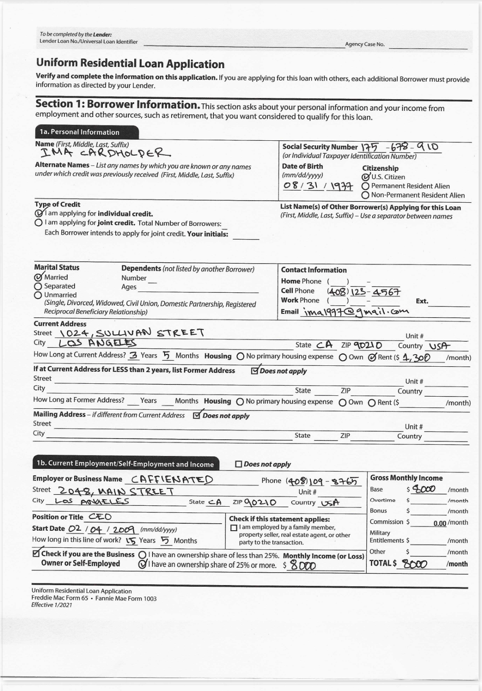
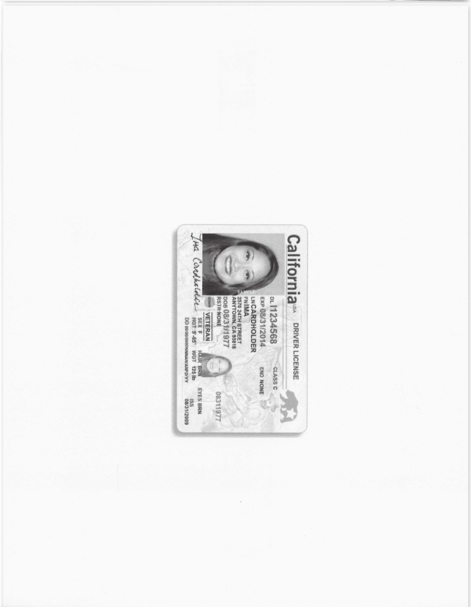

# Processing badly scanned, handwritten, real-world PDFs with LLMWhisperer
This is a demonstration and companion repo that shows how to process challenging PDFs that contain hand-filled forms with elements like checkboxes and radiobuttons and also bad scan pages the unfriendly orientations with [LLMWhisperer](https://unstract.com/llmwhisperer/). LLMWhisperer is a text extraction service that specifically targets large language models (LLMs).

PDF forms have checkboxes and radiobuttons that can be filled out by hand by the user. These form elements are used to collect various bits of important data from them. In this repo, we will show how to extract these form elements using LLMWhisperer in a way that LLMs can understand.

LLMWhisperer can both recognize checkboxes and radiobuttons and also render them in the extracted text in a manner that LLMs can understand. This allows you to use an LLM to process forms in PDFs.

LLMWhisperer can also deal with pages that have scans that do not maintain the expected orientation. In this example, we'll deal with a driver's license that is rotated 90 degrees, or is placed in portrait mode, which is not the expected orientation.

## How this works
We'll call the LLMWhisperer API to extract text from a PDF form that contains checkboxes and radiobuttons. The extracted text will contain the form elements and their values rendered in a way LLMs can comprehend. You'll also see that LLMWhisperer handle pages that have scans in the wrong orientation without issues. We'll then parse this text to extract the values of the checkboxes and radiobuttons using Langchain in combination with Pydantic, finally generating the structured JSON output we need. We'll use OpenAI's GPT-3.5-Turbo as the LLM in this example.

## Supported operating systems
You should be able to run this on Linux or on a Mac. Windows is not supported, although one should be able to make it run there with minor changes.

## Keys you'll need
You'll need keys for OpenAI and [LLMWhisperer](https://unstract.com/llmwhisperer/), which you can get for free. Please read the blog post for more information. Once you have the keys, please add them to the `.env` file in the root of the project.

## Running the code
Clone this repo and change to the `llmwhisperer-handwritten-pdf-extraction` directory. We suggest you run the code after you've created a Python virtual environment. You can create a virtual environment by running the following command:

```bash
python3 -m venv .venv
```

Next, activate the virtual environment:

```bash
source .venv/bin/activate
```

Now, install the dependencies:

```bash
pip install -r requirements.txt
```

Next, copy the `sample.env` file to `.env`, edit the `.env` file to add your OpenAI and LLMWhisperer keys:

```bash
cp sample.env .env
```

Finally, run the code:
    
```bash
python main.py 
```


## PDF form and driver's license we'll be extracting data from
We will be using the following PDF form to demonstrate how to process checkboxes and radiobuttons with LLMWhisperer:




## How the extracted text from LLMWhisperer looks like
```plaintext

   To be completed by the Lender: 
   Lender Loan No./Universal Loan Identifier 
                                                                                                      Agency Case No. 

  Uniform       Residential Loan Application 
  Verify and complete the information on this application. If you are applying for this loan with others, each additional Borrower must provide 
  information as directed by your Lender. 

  Section 1: Borrower Information. This section asks about your 
                                                                                      personal information and your income from 
  employment and other sources, such as retirement, that you want considered to qualify for this loan. 

   1a, Personal Information 
  Name (First, Middle, Last, Suffix) 
                                                                                 Social Security Number 175-678-910 
    IMA         CARDHOLDER                                                       (or individual Taxpayer Identification Number) 
  Alternate Names - List any names by which you are known or any names           Date of Birth             Citizenship 
  under which credit was previously received (First, Middle, Last, Suffix)       (mm/dd/yyyy)                 U.S. Citizen 
                                                                                                           [X] 
                                                                                  08/31/1977               [ ] Permanent Resident Alien 
                                                                                                           [ ] Non-Permanent Resident Alien 
  Type of Credit                                                                 List Name(s) 
                                                                                              of Other Borrower(s) Applying for this Loan 
  [X] I am applying for individual credit.                                       (First, Middle, Last, Suffix) - Use a separator between names 
 [ ] I am applying for joint credit. Total Number of Borrowers: 
     Each Borrower intends to apply for joint credit. Your initials: 

 Marital Status              Dependents (not listed 
                                                    by another Borrower)         Contact Information 
 [X] Married                 Number                                              Home 
                                                                                       Phone (        ) 
 [ ] Separated               Ages 
                                                                                 Cell Phone     (408) 123-4567 
 [ ] Unmarried 
                                                                                 Work Phone     (     )                     Ext. 
     (Single, Divorced, Widowed, Civil Union, Domestic Partnership, Registered 
     Reciprocal Beneficiary Relationship)                                        Email ima1997@gmail.com 
 Current Address 
 Street   1024, SULLIVAN                 STREET                                                                          Unit # 
 City    LOS       ANGELES                                                            State CA      ZIP 90210          Country USA 
 How Long at Current Address? 3 Years 5 Months Housing [ ] No primary housing expense [ ] Own [X] Rent ($ 1,300                       /month) 

 If at Current Address for LESS than 2 years, list Former Address      [X] Does not apply 
 Street                                                                                                                  Unit # 
 City                                                                                State          ZIP                Country 

 How Long at Former Address?        Years      Months Housing [ ] No primary housing expense [ ] Own [ ] Rent ($                      /month) 
 Mailing Address - if different from Current Address [X] Does not apply 
 Street                                                                                                                  Unit # 
 City                                                                                State          ZIP               Country 

  1b. Current Employment/Self-Employment and Income               [ ] Does not apply 

 Employer or Business Name       CAFFIENATED                              Phone (408) 109-8765                Gross Monthly Income 
 Street   2048, MAIN                                                                                          Base        $ 8000       /month 
                                 STREET                                               Unit # 
 City   LOS                                                                                                   Overtime    $            /month 
                ANGELES                            State CA      ZIP 90210          Country USA 
                                                                                                              Bonus      $             /month 
 Position or Title CEO                                          Check if this 
                                                                             statement applies:              Commission $         0.00 /month 
 Start Date 02/04/2009                                           [ ] I am employed by a family member, 
                                                                   property seller, real estate agent, or other Military 
 How long in this line of work? 15 Years   5 Months                party to the transaction.                 Entitlements $            /month 
 [X] Check if you are the Business [ ] I have an ownership share of less than 25%. Monthly Income (or Loss) Other        $             /month 
    Owner or Self-Employed         [X] I have an ownership share of 25% or more. $ 8000                      TOTAL $ 8000             /month 

 Uniform Residential Loan Application 
Freddie Mac Form 65 . Fannie Mae Form 1003 
Effective 1/2021 
<<<


Californiavs            DRIVER LICENSE 

                                    CLASS C 
                 DL 11234568 
                 EXP 08/31/2014     END NONE 
                 LNCARDHOLDER 
                 FNIMA 
                 2570 24TH STREET 
                 ANYTOWN. CA 35818 
                 DOB 08/31/1977 
                 RSTR NONE                08311977 

                     VETERAN 
                       SEX F   HUR BRN   EYES BRN 
Ina                   HGT 5-85 WGT 125 16   ISS 
                                            02/31/2009 
<<<
```

## Final output JSON
```json
{
    "personal_details": {
        "name": "IMA CARDHOLDER",
        "ssn": "175-678-910",
        "dob": "1977-08-31T00:00:00Z",
        "citizenship": "U.S. Citizen"
    },
    "extra_details": {
        "type_of_credit": "Individual",
        "marital_status": "Married",
        "cell_phone": "(408) 123-4567"
    },
    "current_address": {
        "street": "1024 SULLIVAN STREET",
        "city": "LOS ANGELES",
        "state": "CA",
        "zip_code": "90210",
        "residing_in_addr_since_years": 3,
        "residing_in_addr_since_months": 5,
        "own_house": false,
        "rented_house": true,
        "rent": 1300,
        "mailing_address_different": false
    },
    "employment_details": {
        "business_owner_or_self_employed": true,
        "ownership_of_25_pct_or_more": true
    },
    "license": {
        "number": "DL 11234568",
        "issue_date": "2009-02-31T00:00:00Z",
        "expiration_date": "2014-08-31T00:00:00Z",
        "issue_state": "CA",
        "last_name": "LNCARDHOLDER",
        "first_name": "IMA",
        "dob": "1977-08-31T00:00:00Z"
    }
}
```